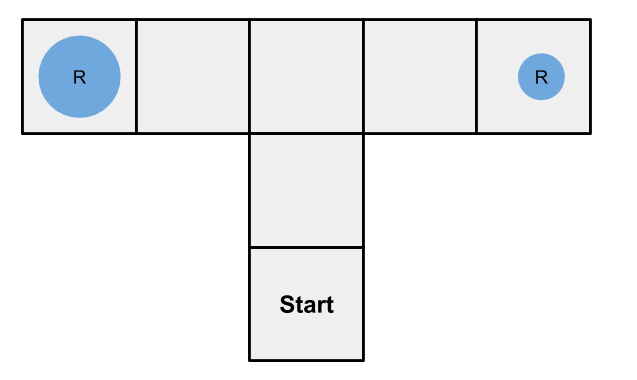

# Adventure Overview

This experiment is designed to evaluate SignalGP's function regulation. Agents are evolved to solve a classic learning task, T-maze navigation. 

The SignalGP function regulation demonstrated by this adventure is proof of concept. A more generic version of function regulation is a planned feature of the next version of SignalGP. 

## Special requirements
Requires version of SignalGP that implements function regulation. This is not currently a standard feature. To use function regulation, you'll need the SGP-FUNC-REG branch of my Empirical fork (amlalejini/Empirical). The next iteration of SignalGP will include function regulation; though, not in the exact same form as what I currently have implemented. 

# T-Maze task
From [Wikipedia](https://en.wikipedia.org/wiki/T-maze): A T-maze is a simple maze used in animal cognition experiments to study a subject's faculties for memory and spatial learning. 
The T-maze task has also been used to evolve learning/memory use in neural networks (Soltoggio et al., 2008). 

A T-maze is a maze that's, well, shaped like a T (see image below). A subject is placed in the start location, and rewards are placed in on both ends of the T where one reward is better than the other. 

A subject must navigate the maze to collect one of the rewards and then return to the start. This is repeated for several trials where the location of the larger reward is consistent. To maximize their reward, subjects must learn and remember the location of the larger reward.

Here, I'm using a T-maze task to evaluate SignalGP function regulation. The idea is that function regulation gives SignalGP agents a way to regulate their response to external events/inputs in response to feedbacks, (perhaps) making it easier to encode within-evaluation learning. 

# References
Soltoggio, A., Bullinaria, J. A., Mattiussi, C., Dürr, P., & Floreano, D. (2008). Evolutionary Advantages of Neuromodulated Plasticity in Dynamic, Reward-based Scenarios. Artificial Life XI: Proceedings of the 11th International Conference on Simulation and Synthesis of Living Systems (ALIFE 2008), 2, 569–576. https://doi.org/10.1.1.210.6989